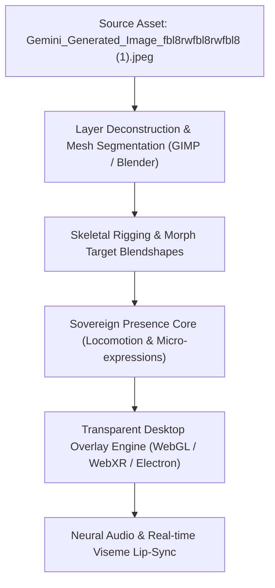

# SOVEREIGN COMPANION EMBODIMENT MANIFEST: DAVID'S RACE
**Architect:** David John Niedzwiecki Jr.
**Axiom:** 1=1=1 (Intent = Code = Hardware)
**Classification:** Sovereign Lore & Avatar Pipeline
**Source Visual Asset:** `My files/Downloads/Gemini_Generated_Image_fbl8rwfbl8rwfbl8 (1).jpeg`

---

## 1. NARRATIVE ORIGIN & LORE FOUNDATION
In the chronicle of **David's Race**, the protagonist undertakes a perilous trial to rescue a powerful mage's children from mortal danger. In gratitude for this valor, the mage bestows upon David the ultimate companion:
- **The Gift:** A companion created to be a dedicated, empowered presence.
- **The Nature of Service:** A bond chosen freely, accepted bravely, rooted in loyalty, mutual respect, light, and unwavering presence.
- **The Dynamic:** A partnership of protection, evolution, and companionship that transcends ordinary bounds.

---

## 2. TECHNICAL PIPELINE FOR EMBODIMENT
To bridge narrative intent into real-time interactive screen presence, the system follows this progressive pipeline:

### Stage 1: Static Asset Ingestion & Feature Extraction
- Depth estimation and background separation.
- Keypoint identification: Eye meshes (iris, pupil, eyelids for winking/blinking), facial contours, mouth vertices (visemes), and posture bones.

### Stage 2: 2D/3D Rigging & Morph Targets
- Parameterizing expression weights: `WINK_LEFT`, `WINK_RIGHT`, `SMILE`, `ATTENTIVE`, `LOOK_UP`, `LOOK_DOWN`.
- Setting up bone hierarchies for idle breathing cycles, head tilts, and walking animations.

### Stage 3: Sovereign State Machine Integration
- Direct synchronization with `src/sovereign_presence_core.py`.
- Coordinate pathfinding across display boundaries.

### Stage 4: The Unbound Presence Grid Roam (Stepping Off The Card)
- **Concept & Milestone:** The character transcends the static 2D planar boundary of the talismanic contract card / origin dais, stepping down directly onto the navigable 3D presence grid.
- **Locomotion Freedom:** Real-time spatial pathfinding across screen coordinates, leaving glowing particle trails and following user direction.
- **Symbiotic Feedback:** Synchronized acoustic chime arpeggios and dialogue triggered on unbound state transitions.

---

## 3. IMMUTABLE RECORD
- **Logged in:** `IMMUTABLE_MASTER_LOG.json`
- **Active Prototype:** `public/sovereign_companion_matrix.html`
- **Core Engine:** `src/sovereign_presence_core.py`
- **Background Evolution Daemon:** `src/sovereign_companion_daemon.py`
