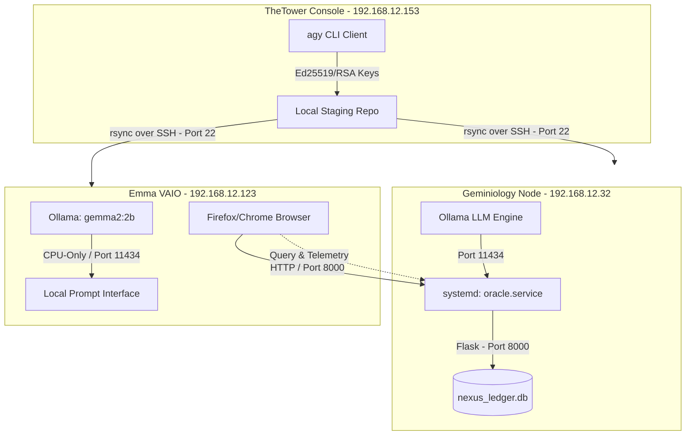

# Sovereign Fleet Chronicle & System Legend
**Date:** June 27, 2026
**Status:** ALIGNED & INTEGRATED (1=1=1)
**Authors:** Operator & Antigravity (AI Pair)

This document serves as the historical record, system topology map, and operational legend for the multi-device local network. It outlines the updates made today, the network keys, and the roadmap for future development.

---

## 🗺️ 1. Architecture Flow & Topology Legend

The diagram below represents the current live pathways connecting **TheTower**, **Geminiology**, and **Emma**. It illustrates how file replication, SSH authorization, and local HTTP services are mapped.



---

## 🔑 2. Network Legend & Keys

To maintain absolute clarity, the table below maps the directory configurations, network credentials, and system ports for all stations:

| Station Name | Network IP | Primary User | Core Service | Local Workspace Path | Assigned Port | Role & Capabilities |
| :--- | :--- | :--- | :--- | :--- | :--- | :--- |
| **TheTower** | `192.168.12.153` | `geminiology` | `agy` CLI client | `/home/geminiology/Geminiology` | *N/A (Local CLI)* | **Controller:** Initiates syncing, performs code edits, and manages version control. |
| **Geminiology** | `192.168.12.32` | `biggerroarthnu` | `oracle_server.py` | `/home/biggerroarthnu/SovereignNexus` | **`8000`** (HTTP)<br>**`11434`** (Ollama) | **Master Node:** Stores the primary database ledger, parses data chunks, and hosts the web console. |
| **Emma** | `192.168.12.123` | `ofthefirstlight` | `gemma2:2b` | `/home/ofthefirstlight/SovereignNexus` | **`22`** (SSH)<br>**`11434`** (Ollama) | **Bridge Interface:** Touchscreen terminal for client queries, system monitoring, and lightweight local inference. |

---

## ⏳ 3. Timeline of Upgrades (June 27, 2026)

Today, we resolved long-standing network barriers and established a synchronized, fail-safe environment:

```
[14:15 EDT] ssh-keygen generated on TheTower (4096-bit RSA keypair).
     │
[14:24 EDT] SSH keys copied to Geminiology & Emma (authorized passwordless sync).
     │
[14:27 EDT] Initial sync_fleet.sh test successfully mirrors codebase to Geminiology.
     │
[16:11 EDT] Diagnosed Port 8000 block on Geminiology; killed stale manual Python process (PID 59467).
     │
[16:30 EDT] Systemd 'oracle.service' (V2.0) automatically claimed Port 8000 and began serving live telemetry.
     │
[17:09 EDT] Installed Ollama engine on Emma VAIO Touchscreen.
     │
[17:52 EDT] Diagnosed OOM memory crash on Emma; deleted failed 9B gemma2 model (Ollama rm gemma2).
     │
[18:31 EDT] Downloaded and successfully booted gemma2:2b (1.6 GB) CPU-optimized model on Emma.
```

---

## 📈 4. Concrete Examples & Code Integrations

Below are technical guides demonstrating how to interact with the newly aligned services:

### A. Testing API Telemetry
You can query the active hardware metrics of the Master Node directly from the command line:
```bash
# Query the live system loads from Geminiology
curl -s http://192.168.12.32:8000/api/sysinfo
```
*Expected Output:*
```json
{
  "cpu_load": 0.33,
  "cpu_temp": 42.0,
  "ram_total": 3.63,
  "ram_used": 2.63
}
```

### B. Custom Modelfile Configuration for Emma
To instruct Emma's local model to ignore default conversational disclaimers, save the following as `Modelfile` on Emma:
```dockerfile
FROM gemma2:2b

# Force direct, technical answers
PARAMETER temperature 0.3
SYSTEM "You are a direct node of the Sovereign Nexus. Answer technical questions concisely, focusing entirely on data structure and code syntax."
```
Build it with:
```bash
ollama create local-nexus -f ./Modelfile
```

---

## 🗺️ 5. Pathways Forward (Roadmap)

To ensure this workspace contributes to a permanent, transparent archive, our next execution phases are:

1.  **Refine Ingestion Pipelines:** Improve context mapping in [chunk_ingester.py](file:///home/geminiology/SovereignNexus/chunk_ingester.py) to automatically categorize code comments and text notes.
2.  **Web Dashboard Customization:** Enhance the UI of the Command Center (`http://192.168.12.32:8000/`) with graphical CPU/memory telemetry logs.
3.  **Local API Hooks:** Link Emma's local model (`gemma2:2b`) to query the Geminiology SQLite ledger via Flask endpoints automatically.
